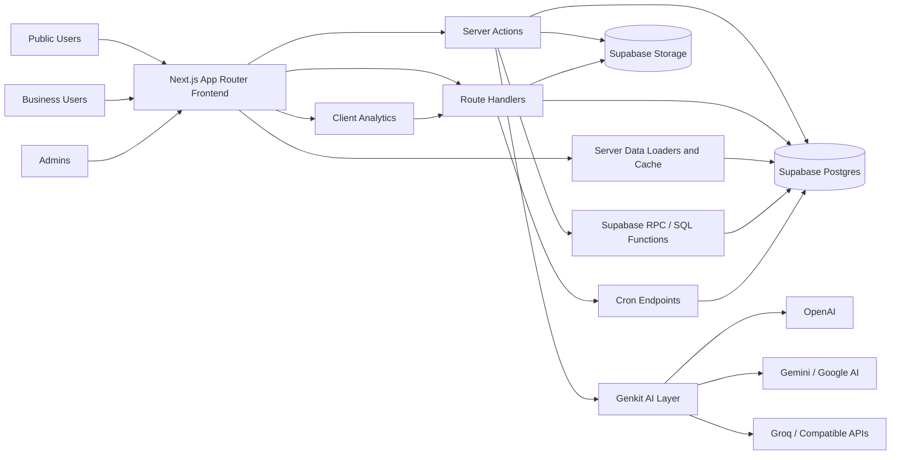
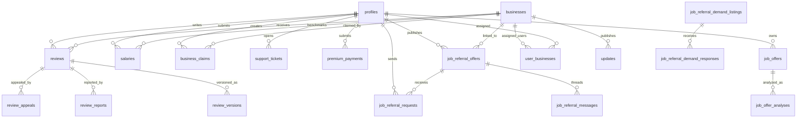

# AVis Product Documentation

Repository-based product and engineering documentation, generated from the codebase state on 2026-03-23.

## 1. App Overview

- App name: `Reviewly` is the fallback site name in code. `site_settings.site_name` can override it at runtime. `AVis` appears to be the repository/product working name.
- One-paragraph summary: this is a Morocco-oriented business reputation and employer intelligence platform built on Next.js and Supabase. It combines a public business directory, employee reviews, salary transparency, a referral marketplace, business claiming and owner tooling, premium subscriptions, support workflows, and a newer standalone job-offer analysis module.
- Main problem it solves: it gives job seekers and employees more signal about employers, while giving businesses a way to claim their presence, respond to reputation signals, and buy premium visibility/insight features.
- Target users:
  - Employees and job seekers looking for reviews, salaries, and referrals
  - Business owners or company representatives managing their public business profile
  - Internal admins and moderators operating content, claims, payments, and platform settings
- Core value proposition:
  - Public trust layer for businesses and employers
  - Reputation management and lightweight CRM-style tooling for business owners
  - Salary and referral data to increase labor-market transparency
  - An AI-assisted job-offer analysis feature to evaluate offers against market benchmarks
- Current product scope:
  - Public business discovery and SEO-oriented landing pages
  - Authenticated review and salary submission
  - Referral offers and public referral demand listings
  - Business claim submission and verification
  - Business dashboard, updates, messaging, widgets, analytics, and premium billing workflow
  - Admin panel for moderation, business/user management, settings, payments, support, and audits
  - Job-offer analysis storage, history, scoring, and benchmark comparison
- Current maturity level: production-like beta
  - Assessment: the app has broad feature coverage, cron jobs, RLS-backed data access, premium/payment flows, and admin tooling, but it also carries legacy/new model overlap, feature-flagged SEO cutovers, and some partially transitional product areas.
- Assumption: the primary market is Morocco, based on `MAD` pricing, French copy, `+212` phone formatting, Morocco-specific locales, and city/sector salary pages.

## 2. Product Summary

### Main modules and features

- Public directory and business detail pages
- Reviews and moderation
- Salary barometer and salary submissions
- Referral marketplace
- Business claim and pro onboarding
- Business owner dashboard
- Premium subscription and offline payment submission
- User profile, saved businesses, and support tickets
- Blog and reports content hubs
- Admin operations and moderation
- Standalone job-offer analysis module

### Key user journeys

- Browse businesses by city, category, search query, tags, and filters
- Open a business page and read reviews, salary insights, and referral activity
- Sign up or log in, then submit a review or salary
- Request a referral or publish an eligible referral offer/demand
- Claim a business and verify ownership by email, phone, document, or video
- Manage one or more businesses from the dashboard
- Submit an offline premium payment reference and wait for admin verification
- Run a job-offer analysis from pasted text or a URL and save it to history

### User types and roles

- Anonymous visitor
- Authenticated standard user
- Authenticated business user (`profiles.role = pro`)
- Admin user (`profiles.role = admin`) with finer-grained admin access levels and permissions
- Multi-business assignee through `user_businesses`

### What users can do in the app today

- Discover businesses, categories, cities, blog posts, reports, salaries, and referrals
- Save businesses, manage profile data, export personal data, and request account deletion
- Create reviews and salary submissions
- Publish referral offers if trust eligibility rules pass
- Publish public referral demand listings
- Claim a business and upload proof files to storage
- Reply to reviews, manage updates, review analytics, view salary benchmark data if eligible, export business data, and submit premium payments from the dashboard
- Open support tickets and view ticket status/responses
- Use the job-offer analysis workflow and view past analyses

### What seems planned but not fully implemented yet

- PDF ingestion for job-offer analysis is described on the job-offers landing page, but the current action accepts `sourceText` or `sourceUrl`
- Stripe and PayPal appear in premium payment UI as placeholders; the implemented payment flow is offline/manual verification
- The repo contains ad and competitor-ad surfaces in code while later migrations indicate ad-table removal work
- Some SEO route cutover behavior is still behind environment flags
- Multi-platform hosting intent is ambiguous because both `vercel.json` and `apphosting.yaml` are present

### Key differentiators visible in the implementation

- The product is not just a review site; it combines reviews, salary data, referrals, pro tooling, and admin operations in one data model
- Business claiming includes risk-aware verification states and reverification automation, not just a simple “claim” flag
- Referral publishing uses trust gating: verified email plus at least one published review or salary
- Job-offer analysis is modeled as its own domain with dedicated tables, scoring, and benchmark views instead of being bolted onto salary pages

## 3. Functional Documentation

### 3.1 Discovery and Directory Browsing

- Feature name: business discovery and directory
- Purpose: help users find businesses through search, SEO landing pages, and filters
- Entry points:
  - `/`
  - `/businesses`
  - `/companies`
  - `/categories`
  - `/categorie/[categorySlug]`
  - `/ville/[citySlug]`
  - `/ville/[citySlug]/[categorySlug]`
  - `/top-rated`
  - `/recently-added`
- Main UI elements:
  - Hero search and autocomplete
  - Filter sidebar and mobile filter sheet
  - Category, city, rating, amenities, tag, sort, and pagination controls
  - Featured businesses, collections, trust signals, and ad slots
- Inputs:
  - Search query
  - Category/subcategory
  - City/quartier
  - Type
  - Rating threshold
  - Amenities/benefits
  - Tag and sort order
- Outputs:
  - Filtered paginated business cards
  - Canonical SEO pages for city/category combinations
  - Search analytics logging
- Validation rules:
  - Query params are normalized in the listing layer
  - Search API validates query payloads with Zod
- Business logic:
  - Relevance sorting prioritizes sponsored entries, then tiered/premium businesses, then rating
  - `/businesses` can redirect to more specific `/ville/...` or `/categorie/...` canonical routes
  - Home sections are partially controlled by `site_settings.home_sections_config`
- Edge cases:
  - Slug changes are handled through redirect lookup
  - Minimal cached data is used for certain list UIs
- Empty states:
  - No-result state in `BusinessList` with filter reset options
- Error states:
  - Search API rate limiting or malformed search input
  - Data fetch fallback to defaults/cached content where possible
- Dependencies:
  - `businesses`, `categories`, `seasonal_collections`, `site_settings`
  - `getFilteredBusinesses`, `getCachedBusinesses`, `getActiveCategories`, `getSeasonalCollections`
- Related database entities / APIs / services:
  - `businesses`
  - `search_analytics`
  - `/api/businesses/search`
  - `/api/v1/businesses/search`
- UX limitations / technical debt:
  - Legacy and new company routes coexist (`/companies` and `/businesses`)
  - SEO cutover is partly env-flag driven rather than fully resolved

### 3.2 Business Detail and Reputation Surface

- Feature name: business profile page
- Purpose: show public reputation, profile information, and business-adjacent insights in one place
- Entry points:
  - `/businesses/[slug]`
  - Alias and redirect surfaces under `/companies` and `best-[slug]`
- Main UI elements:
  - Business header with logo, cover, metadata, trust badges
  - Tabs for reviews, salaries, and referrals
  - Sidebar with contact actions, similar businesses, and premium/promotional blocks
  - JSON-LD metadata for organization and reviews
- Inputs:
  - Business slug
  - Active tab context
- Outputs:
  - Business profile content
  - Review list and counts
  - Salary stats if salary module is enabled and minimum sample requirements pass
  - Referral activity summary
- Validation rules:
  - Slug resolution can fall back through id/sanitized key/redirect mapping
- Business logic:
  - Claimed/unclaimed trust state is surfaced
  - Salary visibility follows site settings and sample-size policy
  - Page revalidation occurs after review mutations
- Edge cases:
  - Business moved to a new slug
  - Missing optional fields such as logo, cover, website, phone, description
- Empty states:
  - No reviews
  - No salary data
  - No referral activity
- Error states:
  - Not found business page
  - Incomplete salary metrics
- Dependencies:
  - `getBusinessById`
  - salary/referral data helpers
  - analytics tracking
- Related database entities / APIs / services:
  - `businesses`
  - `reviews`
  - `salaries`
  - `job_referral_offers`
  - `job_referral_demand_listings`
- UX limitations / technical debt:
  - Business page mixes many concerns into one route
  - Some premium/ads surfaces appear tied to a legacy monetization model under active migration

### 3.3 Reviews

- Feature name: review submission and review moderation
- Purpose: collect employee/user reviews on businesses and moderate them before or after publication
- Entry points:
  - `/review`
  - `/businesses/[slug]/review`
  - Profile review management under `/profil`
  - Admin moderation pages
- Main UI elements:
  - Review form with employment context, rating, optional subratings, title, text, and anonymity toggle
  - Report/appeal dialogs
  - Owner reply interfaces in pro surfaces
- Inputs:
  - Business identifier
  - Employment status, tenure, contract type, work mode
  - Role slug and city slug
  - Rating and optional subratings
  - Title/content
  - Anonymous flag
- Outputs:
  - Review record, usually `pending` unless auto-approved
  - Notifications to business owners/admins
  - Updated business review aggregates after publication
- Validation rules:
  - Auth required
  - Zod validation via `reviewSchema`
  - Sanitization on title and content
  - Rate limiting per user
  - Business owner cannot review their own business
- Business logic:
  - AI moderation runs only if Gemini/Google keys are configured
  - Admins and `auto_approve_media` users can bypass pending flow
  - Review appeals create separate moderation workflow entries
- Edge cases:
  - Review edited after publication
  - Appeal already open
  - User not logged in
- Empty states:
  - No reviews on a business
  - No user reviews on profile
- Error states:
  - Validation failures
  - Rate limit blocks
  - Auth failure
  - Moderation rejection
- Dependencies:
  - Supabase auth
  - AI moderation flow
  - notification helper
- Related database entities / APIs / services:
  - `reviews`
  - `review_versions`
  - `review_moderation_events`
  - `review_appeals`
  - `review_reports`
- UX limitations / technical debt:
  - AI moderation silently degrades to no AI moderation when provider keys are absent
  - Appeal UX currently uses prompt-style input on the profile page

### 3.4 Salary Transparency

- Feature name: salary barometer and salary submissions
- Purpose: expose salary benchmarks by company, role, city, and sector, and collect more salary data
- Entry points:
  - `/salaires`
  - `/salaires/partager`
  - `/salaires/comparaison`
  - `/salaires/[roleSlug]/[citySlug]`
  - `/salaires/secteur/[sectorSlug]/[citySlug]`
  - Business salary tabs
- Main UI elements:
  - Salary benchmark cards and market comparisons
  - Quick submission flow
  - Comparison views
  - Role/city/sector landing pages
- Inputs:
  - Salary amount/range
  - Role, department, business, city
  - Employment context
- Outputs:
  - Pending salary submission
  - Aggregated views and benchmark metrics
- Validation rules:
  - Auth required for submission
  - Rate limiting
  - Zod validation with `salarySubmissionSchema`
  - Role/department/salary interval lists may be constrained by site settings
- Business logic:
  - Public display respects minimum sample size
  - Analytics views are refreshed on salary publication
  - Salary benchmark access in dashboard is Gold-only
- Edge cases:
  - Business city normalization
  - Sparse data below publication threshold
- Empty states:
  - Not enough samples to show detailed metrics
- Error states:
  - Invalid configured role/department interval
  - Missing auth
  - Publication/moderation failure
- Dependencies:
  - salary analytics materialized views
  - notification subscriptions
- Related database entities / APIs / services:
  - `salaries`
  - `salary_alert_subscriptions`
  - `salary_company_metrics`
  - `salary_city_metrics`
  - `salary_city_sector_metrics`
  - `salary_role_city_metrics`
  - `salary_career_path_metrics_mv`
- UX limitations / technical debt:
  - Legacy `/salary/*` aliases still exist
  - Salary surfaces depend heavily on database views; local setups without seeded analytics may appear sparse or broken

### 3.5 Referral Marketplace

- Feature name: referrals marketplace
- Purpose: let trusted users publish referral offers or public demand listings, message each other, and manage requests
- Entry points:
  - `/parrainages`
  - `/parrainages/new`
  - `/parrainages/demandes/new`
  - `/parrainages/[id]`
  - `/parrainages/demandes/[id]`
  - `/parrainages/inbox`
  - `/parrainages/mes-offres`
  - `/parrainages/mes-demandes`
  - `/parrainages/mes-demandes-publiques`
- Main UI elements:
  - Marketplace listing grid
  - Offer and demand publish forms
  - Filters by city, role, contract, mode, seniority, and listing type
  - Messaging and request flows
  - Trust labels and safety warnings
- Inputs:
  - Listing metadata
  - Optional linked business
  - Candidate intro and optional CV link
  - Report/block actions
- Outputs:
  - Offer/demand records
  - Referral requests/messages
  - Notifications to participants
  - Derived trust metrics
- Validation rules:
  - Auth required
  - Rate limiting
  - Unsafe-content checks
  - Offer publishing requires verified email and at least one published review or salary
  - Own-offer requests are blocked
- Business logic:
  - Linked-business offers can earn `verified_employee` identity/trust
  - Marketplace explicitly disallows paid referral arrangements in the UI copy
- Edge cases:
  - User blocks another user
  - Expired or filled listings
  - Untrusted user tries to publish
- Empty states:
  - No offers or demands for current filters
  - No personal listings or inbox activity
- Error states:
  - Eligibility failure
  - Duplicate or invalid business linkage
  - Rate-limit and auth failures
- Dependencies:
  - Eligibility RPC
  - Notifications
  - Business lookup cache
- Related database entities / APIs / services:
  - `job_referral_offers`
  - `job_referral_requests`
  - `job_referral_messages`
  - `job_referral_offer_reports`
  - `job_referral_user_blocks`
  - `job_referral_demand_listings`
  - `job_referral_demand_responses`
  - RPC `can_user_publish_referral_offer`
- UX limitations / technical debt:
  - Referral UX spans several route patterns and could be simplified into a more coherent seller/buyer mental model
  - Trust and eligibility rules are strong, but the reasons are not centralized in a dedicated onboarding screen

### 3.6 Business Claiming and Pro Onboarding

- Feature name: business claim flow
- Purpose: let business representatives claim or create a business profile and become eligible for dashboard access
- Entry points:
  - `/claim`
  - `/claim/new`
  - `/pro`
  - `/pro/signup`
  - `/pour-les-pros`
  - `/pour-les-pros/signup`
- Main UI elements:
  - Search-first claim entry
  - Four-step wizard
  - Local draft persistence
  - Proof method selection
  - File upload and recap steps
- Inputs:
  - Existing business selection or new business metadata
  - Contact information and representative identity
  - Claim type and verification channel
  - Document/video proof uploads when required
- Outputs:
  - Business claim record
  - Optional new or updated business record
  - Verification codes and evidence metadata
  - Dashboard access after approval/verification
- Validation rules:
  - Auth required
  - Tier-based max business count
  - One pending claim at a time
  - New businesses require at least phone or website
  - Document/video proof methods require uploaded file paths
- Business logic:
  - Supports email, phone, document, and video verification
  - Non-admin business edits can be staged rather than directly published
  - Claim risk and reverification flows are modeled in schema
- Edge cases:
  - Already approved claimer
  - Already pending claim
  - Multi-business limit reached
  - Proof upload succeeds but action submission fails
- Empty states:
  - No business match found in claim search
- Error states:
  - Upload failure
  - Invalid verification code
  - Ineligible claim count
- Dependencies:
  - Supabase storage bucket `claim-proofs`
  - claim server actions
  - admin notifications
- Related database entities / APIs / services:
  - `business_claims`
  - `business_claim_events`
  - `claim_verification_evidence`
  - `verification_codes`
  - `businesses`
  - `profiles`
- UX limitations / technical debt:
  - Upload and mutation are separate steps, so partial failure recovery matters
  - Legacy profile business ownership and new `user_businesses` assignment model both exist

### 3.7 Business Dashboard and Premium

- Feature name: pro dashboard and premium management
- Purpose: give claimed businesses operational, reputation, and subscription tooling
- Entry points:
  - `/dashboard`
  - `/dashboard/avis`
  - `/dashboard/messages`
  - `/dashboard/premium`
  - `/dashboard/salary-benchmark`
  - `/dashboard/salary-alerts`
  - `/dashboard/updates`
  - `/dashboard/etablissement`
  - `/dashboard/statistiques`
  - `/dashboard/widget`
  - `/dashboard/support`
  - `/dashboard/companies`
  - `/dashboard/pending`
- Main UI elements:
  - KPI dashboard
  - Review/reply management
  - Business editor
  - Multi-business selector
  - Premium pricing and offline payment submission
  - Widget and export tooling
- Inputs:
  - Current business context
  - Payment reference
  - Business profile edits
  - Update content and support interactions
- Outputs:
  - Aggregated KPIs
  - Business updates
  - Premium payment requests
  - Business exports
- Validation rules:
  - Dashboard auth guard requires a business claim/association
  - Salary benchmark page requires Gold access
  - Premium payment endpoint blocks duplicate pending requests
- Business logic:
  - Dashboard computes profile completion, pending replies, volatility alerts, salary positioning alerts
  - Effective tier combines profile tier and business tier
  - Export API enforces paid-tier business access
- Edge cases:
  - User has multiple businesses from claims and assignments
  - Business id in URL not accessible to current user
  - Expired premium with stale profile tier data
- Empty states:
  - No associated business
  - No unread support tickets
  - No salary benchmark due to insufficient data or access tier
- Error states:
  - Profile load failure
  - Business missing despite claim/profile linkage
  - Offline payment submission failure
- Dependencies:
  - `BusinessContext`
  - tier utilities
  - support, analytics, review, salary, export APIs
- Related database entities / APIs / services:
  - `profiles`
  - `user_businesses`
  - `business_claims`
  - `premium_payments`
  - `premium_users`
  - `business_analytics`
  - `support_tickets`
  - `/api/business/export`
  - `/api/premium-payments`
- UX limitations / technical debt:
  - Dashboard pages expose a broad surface, but access control is split between guard logic and page-level checks
  - Premium flow is manual/offline rather than instant self-serve billing

### 3.8 Job-Offer Analysis

- Feature name: job-offer analysis
- Purpose: score job offers against market data and provide explainable analysis
- Entry points:
  - `/job-offers`
  - `/job-offers/analyze`
  - `/job-offers/history`
  - `/job-offers/[analysisId]`
- Main UI elements:
  - Analysis form with text or URL input
  - Diagnostics/debug panels
  - Structured analysis result with compensation/transparency/quality scoring
  - History list and analysis detail pages
- Inputs:
  - Source text or source URL
- Outputs:
  - Extracted structured job-offer data
  - Normalized salary and contract/work-model fields
  - Deterministic score and label
  - Persisted `job_offers` and `job_offer_analyses` rows
- Validation rules:
  - Current submission action requires auth
  - Input validation requires text or URL
- Business logic:
  - Heuristic extraction runs first/alongside AI extraction
  - Benchmarks are looked up by company and role/city
  - AI provider fallback order is configurable
- Edge cases:
  - URL fetch/parsing failure
  - Insufficient salary/location/company context
  - Benchmark data unavailable
- Empty states:
  - No history for current user
  - Insufficient data label in analysis
- Error states:
  - Rate limiting
  - URL extraction failure
  - AI provider failure
  - Auth requirement on save
- Dependencies:
  - Genkit
  - AI providers
  - benchmark views
  - job-offer actions and data helpers
- Related database entities / APIs / services:
  - `job_offers`
  - `job_offer_analyses`
  - `job_offer_company_metrics`
  - `job_offer_role_city_metrics`
- UX limitations / technical debt:
  - Landing page copy references PDF ingestion not yet implemented in the current action
  - Debug output is useful internally but may need tighter product framing for end users

### 3.9 User Profile and Support

- Feature name: user self-service profile and support
- Purpose: let users manage account data, favorites, their content footprint, and support interactions
- Entry points:
  - `/profil`
  - `/profil/saved-businesses`
  - `/profil/settings`
  - `/support`
- Main UI elements:
  - Profile tabs for reviews, favorites, referrals, and account
  - Data export and deletion request controls
  - Support ticket creation form and ticket history list
- Inputs:
  - Profile fields
  - Email preferences
  - Support subject/category/message
- Outputs:
  - Updated profile
  - Data export JSON
  - Deletion request scheduling
  - Support ticket records
- Validation rules:
  - Auth required for profile actions and support ticket creation
  - Profile update schema uses Zod
  - Support ticket requires subject and message
- Business logic:
  - Account deletion is delayed by 30 days
  - Support contact email is sourced from site settings when available
- Edge cases:
  - Logged-out visitor lands on `/profil`
  - User has no reviews or favorites
  - Existing scheduled deletion
- Empty states:
  - No favorites
  - No tickets
  - No user reviews
- Error states:
  - Ticket creation failure
  - Export failure
  - Profile save failure
- Dependencies:
  - Supabase auth/client
  - user and support server actions
- Related database entities / APIs / services:
  - `profiles`
  - `favorites`
  - `support_tickets`
  - `support_ticket_messages`
- UX limitations / technical debt:
  - Support page contains static phone/chat placeholders alongside actual ticketing
  - Deletion cancellation is labeled “coming soon”

### 3.10 Content, Reports, and Marketing Surfaces

- Feature name: content hubs and static pages
- Purpose: support SEO, thought leadership, and product explanation
- Entry points:
  - `/blog`
  - `/blog/[slug]`
  - `/reports`
  - `/reports/[reportSlug]`
  - `/about`
  - `/contact`
  - `/rules`
  - `/privacy`
  - `/terms`
- Main UI elements:
  - Article/report listings
  - Static marketing/legal content
  - Contact and support links
- Inputs:
  - Slugs and CMS-style content ids
- Outputs:
  - Public content pages
- Validation rules:
  - Route-level not found handling for missing content
- Business logic:
  - Content hubs participate in SEO cutover flags
- Edge cases:
  - Missing slug content
- Empty states:
  - Empty listing surfaces depend on seeded content
- Error states:
  - Content fetch failure
- Dependencies:
  - `blog_articles`
  - report content data sources
- Related database entities / APIs / services:
  - `blog_articles`
  - report-related tables/views need verification
- Needs verification: the exact report-content authoring workflow was not fully traced from the inspected files.

### 3.11 Admin and Moderation

- Feature name: admin control plane
- Purpose: operate users, businesses, moderation queues, claims, payments, support, referrals, salaries, settings, and audits
- Entry points:
  - `/admin`
  - `/admin/*` child routes
- Main UI elements:
  - Admin sidebar with grouped sections
  - Search, moderation queues, settings forms, audit tables, and diagnostics panels
- Inputs:
  - Moderation decisions
  - User and business updates
  - Settings changes
  - Payment approval/rejection
- Outputs:
  - Content status changes
  - Premium state changes
  - Audit log entries
  - Notifications and queue transitions
- Validation rules:
  - Server-side admin auth and permission checks
  - RBAC permissions for sensitive actions such as maintenance toggle and user role management
- Business logic:
  - Admin pages are server-protected and redirect to `/login` or `/dashboard` when unauthorized
  - Several flows rely on Supabase RPC/functions and service-role actions
- Edge cases:
  - Admin user without required permission
  - Partial legacy role data in profiles
- Empty states:
  - Empty queues by moderation surface
- Error states:
  - Permission denied
  - Missing service role key for admin-only data helpers
- Dependencies:
  - `verifyAdminSession`
  - `verifyAdminPermission`
  - admin actions
  - service-role Supabase client
- Related database entities / APIs / services:
  - `admin_audit_log`
  - moderation/report tables
  - `site_settings`
  - `premium_payments`
  - `business_outreach_pipeline`
  - admin search APIs
- UX limitations / technical debt:
  - Admin surface is broad and likely hard to onboard into without role-specific documentation
  - There is a mix of legacy French route naming and newer English/internal naming

## 4. Screen-by-Screen Documentation

### Public and acquisition screens

#### `/`

- Screen name: home page
- Purpose: top-level search, discovery, and conversion into business pages, claims, or pro funnel
- Who can access it: public
- Main components:
  - `LazyHomeClient`
  - hero search
  - featured businesses
  - seasonal collections
  - categories
  - trust/recent sections
- User actions:
  - Search
  - browse categories/cities
  - click featured businesses
  - jump to partner/resources links
- Data shown:
  - home metrics
  - featured businesses
  - collections
  - categories
  - site settings
- API/data dependencies:
  - cached business and settings loaders
- Loading / empty / error states:
  - server-rendered; degraded settings/data fall back to defaults where possible
- Notes and improvement opportunities:
  - Home page is feature-rich and marketing-heavy; prioritization and modular ownership would help

#### `/businesses` and `/companies`

- Screen name: business listing
- Purpose: browse/filter businesses
- Who can access it: public
- Main components:
  - `BusinessList`
  - filters
  - pagination
  - ad slots
- User actions:
  - Apply filters
  - search
  - paginate
  - click business cards
- Data shown:
  - paginated business summaries
- API/data dependencies:
  - `getFilteredBusinesses`
  - search logging actions
- Loading / empty / error states:
  - empty-state messaging when no businesses match filters
- Notes and improvement opportunities:
  - `companies` and `businesses` route families should eventually converge on one public vocabulary

#### `/businesses/[slug]`

- Screen name: business detail page
- Purpose: public business reputation and profile page
- Who can access it: public
- Main components:
  - header
  - photo/gallery
  - insights tabs
  - similar businesses
  - sidebar CTAs
- User actions:
  - switch tabs
  - read reviews
  - write review
  - click contact links
  - inspect salaries and referral activity
- Data shown:
  - business profile, review summary, salary metrics, referral activity
- API/data dependencies:
  - business data, salary helpers, referral helpers, analytics tracking
- Loading / empty / error states:
  - not-found page if slug resolution fails
  - empty tab states for reviews/salaries/referrals
- Notes and improvement opportunities:
  - Strong central page, but it is doing many jobs and could become a performance hotspot

#### `/businesses/[slug]/review` and `/review`

- Screen name: review submission
- Purpose: authenticated review authoring
- Who can access it: logged-in users
- Main components:
  - `ReviewForm`
  - business context or business selector
- User actions:
  - fill review form
  - submit review
- Data shown:
  - business being reviewed and form guidance
- API/data dependencies:
  - `submitReview`
- Loading / empty / error states:
  - redirect/login requirement if unauthenticated
  - inline validation errors
- Notes and improvement opportunities:
  - Form is comprehensive; progressive disclosure could reduce completion friction

#### `/claim` and `/claim/new`

- Screen name: claim finder and claim wizard
- Purpose: business representative acquisition into the dashboard
- Who can access it: logged-in users
- Main components:
  - business search
  - status warnings
  - multi-step claim form
- User actions:
  - search business
  - select business or create new one
  - choose proof method
  - upload evidence
  - verify code
- Data shown:
  - claim status, proof requirements, business draft data
- API/data dependencies:
  - `/api/businesses/search`
  - claim actions
  - storage bucket uploads
- Loading / empty / error states:
  - pending/already-claimed redirects
  - business-not-found path
  - verification failures
- Notes and improvement opportunities:
  - Good validation coverage; resumable drafts are implemented client-side only

#### `/salaires`, `/salaires/comparaison`, `/salaires/partager`, `/salaires/[roleSlug]/[citySlug]`, `/salaires/secteur/[sectorSlug]/[citySlug]`

- Screen name: salary hub, compare, share, and benchmark pages
- Purpose: expose salary transparency and collect additional salary submissions
- Who can access it:
  - public for browsing
  - logged-in users for submission
- Main components:
  - benchmark cards
  - compare views
  - quick-submit salary card
- User actions:
  - browse salary pages
  - compare roles/cities
  - submit a salary
- Data shown:
  - aggregated salary metrics and company shortcuts
- API/data dependencies:
  - salary analytics views
  - `submitSalary`
- Loading / empty / error states:
  - low-sample protection and logged-out visibility restrictions
- Notes and improvement opportunities:
  - Salary pages are one of the strongest SEO/product surfaces, but route duplication with `/salary` remains

#### `/parrainages` and child routes

- Screen name: referral marketplace
- Purpose: offer and demand matching
- Who can access it:
  - public for browsing
  - logged-in users for publishing, requesting, messaging
- Main components:
  - marketplace list
  - filters
  - detail pages
  - publish forms
  - inbox and personal listings
- User actions:
  - browse offers and demands
  - request referral
  - publish offer/demand
  - message participants
- Data shown:
  - listing cards, trust labels, applicant/request counts, messages
- API/data dependencies:
  - referral actions
  - Supabase reads for personal areas
- Loading / empty / error states:
  - eligibility warning states
  - no-results marketplace states
  - login redirects for publish/private inbox areas
- Notes and improvement opportunities:
  - Several subroutes exist for role/city/company views; a route map in-product would help navigation

#### `/job-offers`, `/job-offers/analyze`, `/job-offers/history`, `/job-offers/[analysisId]`

- Screen name: job-offer analysis module
- Purpose: standalone analysis workflow
- Who can access it:
  - public can see landing page
  - authenticated users are required for the persisted analysis action
- Main components:
  - marketing landing page
  - analysis form
  - diagnostics panels
  - history list and detail view
- User actions:
  - paste text
  - provide URL
  - run analysis
  - inspect stored analysis
- Data shown:
  - structured extracted job offer
  - benchmark comparisons
  - scores and labels
- API/data dependencies:
  - job-offer actions
  - AI extraction helpers
  - benchmark views
- Loading / empty / error states:
  - missing history state
  - insufficient-data analysis label
  - provider/extraction errors
- Notes and improvement opportunities:
  - Product messaging suggests future document ingestion beyond the current implementation

### Auth, profile, and support screens

#### `/login`, `/signup`, `/forgot-password`, `/reset-password`

- Purpose: account access lifecycle
- Who can access it: public
- Main components:
  - email/password forms
  - LinkedIn OAuth path
  - password reset request/update forms
- User actions:
  - log in
  - sign up
  - request reset email
  - set new password
- Data/API dependencies:
  - auth server actions
  - Supabase auth
- Loading / empty / error states:
  - rate-limit failures
  - hidden-account-existence behavior on password reset
- Notes:
  - New registration can be disabled by runtime site settings

#### `/profil`, `/profil/saved-businesses`, `/profil/settings`

- Purpose: user self-service account area
- Who can access it: logged-in users
- Main components:
  - review tab
  - favorites tab
  - referral stats tab
  - account settings tab
- User actions:
  - edit profile
  - manage preferences
  - export data
  - request account deletion
  - review personal contributions
- Data/API dependencies:
  - user actions
  - favorites
  - review appeals
- Loading / empty / error states:
  - auth-required gate
  - empty review/favorite/referral states
- Notes:
  - `/profile/*` exists as a legacy/English alias

#### `/support`

- Purpose: user-facing support entry point
- Who can access it:
  - public can view the page shell
  - logged-in users are required to submit and view tickets
- Main components:
  - support channels cards
  - new-ticket form
  - ticket history list
- User actions:
  - create a ticket
  - review ticket responses
- Data/API dependencies:
  - support actions
  - `support_tickets`
- Loading / empty / error states:
  - ticket loading spinner
  - empty ticket list
  - login-required toast
- Notes:
  - Static phone/chat content appears illustrative rather than fully integrated

### Pro and dashboard screens

#### `/pro` and `/pour-les-pros`

- Purpose: business-facing marketing and pricing funnel
- Who can access it: public
- Main components:
  - pricing cards
  - feature comparisons
  - multi-business section
  - activation explanation
- User actions:
  - start pro signup
  - jump to premium plans
  - navigate to dashboard premium page
- Data/API dependencies:
  - `site_settings`
  - session profile
  - `PremiumFeatures`
- Loading / empty / error states:
  - server-rendered marketing page; limited runtime failure surface
- Notes:
  - Prices are runtime-configurable via site settings

#### `/dashboard`

- Purpose: business KPI home
- Who can access it: authenticated users with business association or approved claim
- Main components:
  - `DashboardClient`
  - KPI cards
  - action checklist
  - alerts
  - business switcher
- User actions:
  - inspect KPIs
  - change active business
  - follow CTA into deeper dashboard tools
- Data/API dependencies:
  - businesses, reviews, analytics, favorites, support tickets, salary metrics
- Loading / empty / error states:
  - redirect to login
  - no-business state
  - business-load error state
- Notes:
  - Current page composes many reads in one request; watch query growth over time

#### `/dashboard/avis`, `/dashboard/messages`, `/dashboard/updates`, `/dashboard/etablissement`, `/dashboard/statistiques`, `/dashboard/widget`, `/dashboard/salary-benchmark`, `/dashboard/salary-alerts`, `/dashboard/support`, `/dashboard/companies`, `/dashboard/pending`

- Purpose: operational submodules for business owners
- Who can access it: dashboard-eligible users; some pages need higher tier access
- Main components:
  - review management
  - messaging
  - company updates
  - business editor
  - analytics
  - widget configuration
  - salary benchmark and alerts
  - support
  - company switching/listing
  - pending-claim waiting state
- User actions:
  - reply to reviews
  - manage updates
  - inspect performance
  - export/share widgets
  - manage support and salary alerts
- Data/API dependencies:
  - business, reviews, analytics, salary views, support tables, widget/embed helpers
- Loading / empty / error states:
  - pending claim redirect
  - tier-gated salary benchmark access
- Notes:
  - `dashboard/reviews` and `dashboard/avis` both exist; naming consolidation would reduce confusion

#### `/dashboard/premium`

- Purpose: premium plan management and payment submission
- Who can access it: dashboard-eligible users
- Main components:
  - current plan cards
  - billing cycle toggle
  - tier selection
  - payment instructions
  - payment reference submission
- User actions:
  - select plan
  - review banking/payment instructions
  - submit offline payment reference
- Data/API dependencies:
  - `premium_payments`
  - `site_settings`
  - `/api/premium-payments`
- Loading / empty / error states:
  - loading spinner
  - duplicate pending payment block
- Notes:
  - Placeholder Stripe/PayPal sections are present but not yet active

### Admin routes

All `/admin/*` routes require successful admin auth on the server and at least `admin.panel.access`.

#### `/admin`

- Purpose: admin home/dashboard
- Notes:
  - Entry point into the admin shell and grouped moderation/management tools

#### `/admin/analytics`, `/admin/statistiques`, `/admin/diagnostics`, `/admin/audit`

- Purpose: platform analytics, diagnostics, and audit visibility
- Data/API dependencies:
  - analytics tables
  - audit logs
  - health/diagnostic reads
- Notes:
  - Useful for operators; likely where platform-level monitoring is currently concentrated

#### `/admin/utilisateurs`, `/admin/etablissements`, `/admin/business-assignment`, `/admin/business-suggestions`, `/admin/categories`, `/admin/homepage`, `/admin/blog`, `/admin/contenu`, `/admin/outreach`, `/admin/opportunites`, `/admin/parametres`

- Purpose: user, business, taxonomy, content, outreach, and settings management
- Data/API dependencies:
  - `profiles`
  - `businesses`
  - `user_businesses`
  - `site_settings`
  - `blog_articles`
  - business opportunity views/pipeline
- Notes:
  - This is where most “back office” product operations live

#### `/admin/avis`, `/admin/avis-appels`, `/admin/avis-signalements`, `/admin/entreprises-signalements`, `/admin/medias`, `/admin/moderation`, `/admin/parrainages`, `/admin/revendications`, `/admin/salaires`

- Purpose: moderation queues for reviews, appeals, reports, media, referrals, claims, and salaries
- Data/API dependencies:
  - review/report/appeal tables
  - claim tables
  - referral reports
  - salary moderation flows
- Notes:
  - This is the highest-risk operational area for policy and security consistency

#### `/admin/paiements`, `/admin/support`

- Purpose: premium payment verification and support operations
- Data/API dependencies:
  - `premium_payments`
  - `support_tickets`
- Notes:
  - Offline payment model makes payment verification an ongoing admin workload

## 5. User Flows

### 5.1 Sign up / sign in / password reset

- Trigger: user wants to contribute, save content, claim a business, or access dashboard/profile areas
- Step-by-step journey:
  1. User opens `/signup` or `/login`
  2. User signs in via email/password or LinkedIn OAuth
  3. Supabase auth creates or loads the session
  4. On signup, runtime setting `allow_new_registrations` is checked first
  5. Password reset requests send a reset email without revealing whether the account exists
- Decision points:
  - New registrations allowed or disabled
  - Email confirmation flow enabled by Supabase configuration
  - OAuth vs password auth
- Success outcome: active session and redirect into requested page
- Failure points:
  - Rate limiting on login
  - Invalid credentials
  - registration disabled
  - missing reset session on password update
- Missing safeguards or UX gaps:
  - Needs verification: no separate documented MFA flow was visible in the inspected code

### 5.2 Review submission

- Trigger: logged-in user clicks “write review” or lands on `/review`
- Step-by-step journey:
  1. User authenticates if needed
  2. User fills business and employment context
  3. Form validates required fields
  4. Server action sanitizes content and enforces rate limits
  5. Business-owner self-review is blocked
  6. AI moderation may run if configured
  7. Review is inserted as `pending` or auto-published
  8. Notifications and revalidation run
- Decision points:
  - Authenticated or not
  - AI moderation configured or not
  - Auto-approval privilege or normal pending flow
- Success outcome: review stored and visible to moderators or published publicly
- Failure points:
  - Validation failure
  - rate limiting
  - moderation rejection
  - ownership conflict
- Missing safeguards or UX gaps:
  - AI moderation absence means moderation quality varies by environment configuration

### 5.3 Salary submission

- Trigger: user wants to contribute salary data from `/salaires/partager` or business salary context
- Step-by-step journey:
  1. User logs in
  2. User chooses business, role, city, and salary interval
  3. Server validates submission and site-settings constraints
  4. Salary is inserted as pending
  5. Admin moderation publishes it
  6. Salary analytics views are refreshed
  7. Subscribers may be notified via digest automation
- Decision points:
  - Valid salary taxonomy configured or not
  - Publish vs reject moderation result
- Success outcome: salary contributes to benchmark metrics
- Failure points:
  - invalid role/interval selection
  - moderation rejection
  - insufficient data for public visibility
- Missing safeguards or UX gaps:
  - More visible feedback on “why my salary is not public yet” would help contributors

### 5.4 Business claim and pro onboarding

- Trigger: business representative opens `/claim` or pro funnel
- Step-by-step journey:
  1. User searches for a business
  2. User selects an existing business or chooses to create a new one
  3. User enters business and representative details
  4. User chooses a proof method
  5. If needed, proof file is uploaded to storage
  6. Server validates claim count, proof requirements, and business fields
  7. Claim is created and verification codes may be sent
  8. Admin/moderation verifies the claim, or reverification happens later by cron if needed
  9. User gains dashboard access through approved/verified claim or assignment
- Decision points:
  - Existing business vs new business
  - Email vs phone vs document vs video proof
  - Admin direct publish vs staged updates
  - Single-business vs multi-business eligibility by tier
- Success outcome: verified claim and dashboard access
- Failure points:
  - upload failure
  - invalid verification code
  - pending-claim conflict
  - max-business limit reached
- Missing safeguards or UX gaps:
  - Better recovery for partially uploaded claim evidence would reduce support load

### 5.5 Referral offer publishing

- Trigger: logged-in user clicks “publish referral offer”
- Step-by-step journey:
  1. User lands on `/parrainages/new?type=offer`
  2. System checks eligibility through RPC
  3. User selects optional linked business and enters role/listing details
  4. Unsafe-content filters and rate limits run
  5. Offer is inserted and marketplace metrics are updated
- Decision points:
  - Eligible or not
  - Linked business or standalone
  - Verified-employee trust level or lower-trust offer
- Success outcome: offer published and visible in marketplace
- Failure points:
  - email not verified
  - no published review or salary
  - unsafe content or rate-limit failure
- Missing safeguards or UX gaps:
  - Eligibility explanation exists, but there is no dedicated progress indicator showing “1 of 2 trust prerequisites complete”

### 5.6 Referral demand publishing and request flow

- Trigger: user wants help getting referred
- Step-by-step journey:
  1. User publishes a public demand listing or requests a referral on an offer page
  2. Request action checks auth, blocks, rate limits, and own-offer prevention
  3. Notification is created for the offer owner
  4. Messages can continue in inbox routes
- Decision points:
  - Public demand listing vs direct request to an offer
  - Blocked user pair or not
- Success outcome: request created and recipient notified
- Failure points:
  - self-request attempt
  - blocked relationship
  - rate-limit failure
- Missing safeguards or UX gaps:
  - Marketplace moderation and abuse handling should continue to evolve as volume grows

### 5.7 Premium upgrade and verification

- Trigger: business owner wants premium access
- Step-by-step journey:
  1. User opens `/dashboard/premium`
  2. User selects Growth or Gold and billing cycle
  3. User pays externally via bank transfer or enabled partner method
  4. User submits transaction reference
  5. Pending payment is stored
  6. Admin verifies or rejects payment
  7. Premium state/tier is updated
- Decision points:
  - Growth vs Gold
  - monthly vs yearly
  - admin approved vs rejected
- Success outcome: premium features activated
- Failure points:
  - duplicate pending payment
  - invalid transaction reference
  - admin review delay
- Missing safeguards or UX gaps:
  - Manual billing creates a slower activation loop and more operational overhead than integrated payments

### 5.8 Job-offer analysis

- Trigger: user opens `/job-offers/analyze`
- Step-by-step journey:
  1. User pastes offer text or a URL
  2. Input is validated
  3. Heuristic extraction runs
  4. AI extraction runs when provider credentials exist
  5. Extraction outputs are merged and normalized
  6. Company and market benchmarks are queried
  7. Deterministic scores are calculated and stored
  8. User reviews history and detail view
- Decision points:
  - text vs URL input
  - AI provider success vs fallback/degraded mode
  - sufficient data vs insufficient-data result
- Success outcome: stored structured analysis with explainable scoring
- Failure points:
  - bad URL fetch
  - provider failure
  - no benchmark match
- Missing safeguards or UX gaps:
  - There is no visible model confidence governance beyond diagnostics; that matters if this becomes a user-facing growth surface

### 5.9 Admin moderation

- Trigger: moderator/admin opens an admin queue
- Step-by-step journey:
  1. Server checks admin session and permission
  2. Queue pages load relevant content or payment/support/claim items
  3. Admin takes approve/reject/flag/update actions
  4. Side effects run: notifications, tier changes, queue transitions, audit logs, refreshed metrics
- Decision points:
  - Permission available or not
  - approve/reject/escalate action
- Success outcome: moderated item changes state consistently
- Failure points:
  - service-role issues
  - missing permission
  - inconsistent legacy/new fields across old rows
- Missing safeguards or UX gaps:
  - Admin decision support is distributed across many screens; policy consistency may depend on operator knowledge

## 6. Technical Architecture

### Stack

- Frontend stack:
  - Next.js 15 App Router
  - React 19
  - TypeScript
  - Tailwind CSS
  - Radix UI primitives
- Backend stack:
  - Next.js server actions
  - Next.js route handlers
  - Supabase as BaaS
  - Supabase RPC/functions for selected rules and state transitions
- Database:
  - Supabase Postgres
  - extensive RLS
  - materialized views and derived analytics views
- Auth:
  - Supabase Auth
  - email/password
  - LinkedIn OAuth (`linkedin_oidc`)
- Hosting / deployment:
  - `vercel.json` indicates Vercel cron usage
  - `apphosting.yaml` indicates Firebase App Hosting support
  - Needs verification: which target is the active production host
- Storage:
  - Supabase Storage
  - claim proof uploads stored in `claim-proofs`
- Third-party services:
  - Supabase
  - Genkit AI providers
  - optional email providers via runtime settings/env
  - Google Analytics / Google Ads / Meta Pixel when configured
- AI providers / APIs:
  - OpenAI
  - Gemini / Google AI
  - Groq
  - generic OpenAI-compatible provider
- State management:
  - React state
  - context providers (`BusinessContext`, theme, i18n)
  - server-rendered data loaders plus client Supabase fetches
- Form handling:
  - `react-hook-form`
- Validation:
  - Zod
- Analytics:
  - custom analytics event ingestion to Supabase tables
  - optional GA and Meta Pixel
- Payments:
  - offline/manual payment reference workflow
- Notifications:
  - DB-backed notifications
  - support for salary digests, claim/payment/admin events, pro insights

### High-level architecture explanation

The app is a monolithic Next.js application with Supabase handling auth, database, storage, and a large share of authorization via RLS. Public pages mostly use server-side data helpers and cache wrappers. Write operations are primarily implemented as Next.js server actions, while route handlers cover public APIs, exports, health checks, OG image generation, cron endpoints, and a few admin/public search endpoints. AI flows are invoked inside the app rather than through a separate service. Operational automation is handled by scheduled HTTP cron routes.

### System architecture diagram



### Data flow overview

- Read-heavy public pages:
  - Next.js server components call cached data helpers
  - Helpers read from Supabase tables/views
  - Pages render SEO metadata and structured data
- Mutation-heavy user actions:
  - Client form submits to server action
  - Server action validates with Zod, checks auth and rate limits, then writes to Supabase
  - Optional notifications, revalidation, and analytics follow
- File upload path:
  - Client uploads claim proof to Supabase Storage
  - Form then submits storage path metadata through a server action
- AI analysis path:
  - User input enters server action
  - heuristics and optional Genkit provider calls extract structure
  - normalization + benchmark lookups + scoring happen in app code
  - results are persisted to dedicated tables
- Admin/ops automation path:
  - Scheduled cron endpoints run with `CRON_SECRET`
  - jobs update tier expiry, claim verification state, SLA queues, salary digests, and pro insight notifications

## 7. Codebase Structure

### Folder structure

```text
src/
  ai/                Genkit setup and AI flows
  app/               Next.js routes, layouts, server actions, route handlers
  components/        Reusable UI and feature components
  contexts/          React context providers
  hooks/             Shared client hooks
  lib/               Data access, auth, caching, utilities, policies
  scripts/           Seed and operational scripts
  types/             Shared TypeScript types and schemas
supabase/
  migrations/        Database schema evolution
docs/                Product plans, audits, setup docs, and generated documentation
scripts/             Test and validation helpers
```

### Purpose of major directories

- `src/app`: all route surfaces, route-specific server logic, server actions, and APIs
- `src/lib`: the real business-logic center for data fetching, tier rules, permissions, caching, salary policy, referrals, notifications, and service clients
- `src/components`: shared UI, business list/detail pieces, dashboard widgets, forms, ads, and layout primitives
- `src/ai`: provider configuration and prompt/flow definitions
- `supabase/migrations`: source of truth for the implemented data model and many permission rules

### Key reusable components

- `components/shared/HomeClient`
- `components/shared/BusinessList`
- `components/business/BusinessInsightsTabs`
- `components/forms/ReviewForm`
- `components/job-offers/JobOfferAnalysisForm`
- `components/shared/PremiumFeatures`
- shared UI primitives under `components/ui`

### Shared utilities and services

- Supabase clients:
  - `lib/supabase/server.ts`
  - `lib/supabase/client.ts`
  - `lib/supabase/admin.ts`
- Data loaders:
  - `lib/data/*`
- Cache layer:
  - `lib/cache.ts`
- Tier and access utilities:
  - `lib/tier-utils`
  - `hooks/useBusinessProfile`
- Admin RBAC:
  - `lib/admin-rbac.ts`
- Job-offer pipeline helpers:
  - `lib/job-offers/*`
- Notifications:
  - `lib/notifications.ts`

### Hooks / services / API layer

- Hooks:
  - `useBusinessProfile`
  - business context hooks
  - dashboard/profile/support UI hooks
- Services:
  - mostly implemented as `lib/*` helpers and server actions
- API layer:
  - route handlers under `src/app/api`
  - server actions under `src/app/actions`

### Types and schemas

- Shared validation lives in `src/lib/types` and related schema files
- Zod schemas are used in server actions for reviews, salaries, claims, user profile updates, and search inputs

### Config files

- `package.json`
- `next.config.ts`
- `vercel.json`
- `apphosting.yaml`
- Tailwind, TypeScript, Vitest, and Playwright configs

### Environment variables used

#### Core app and URLs

- `NEXT_PUBLIC_APP_URL`
- `NEXT_PUBLIC_SITE_URL`
- `SITE_URL`
- `VERCEL_URL`
- `NEXT_PUBLIC_VERCEL_URL`

#### Supabase

- `NEXT_PUBLIC_SUPABASE_URL`
- `NEXT_PUBLIC_SUPABASE_ANON_KEY`
- `SUPABASE_SERVICE_ROLE_KEY`

#### AI providers

- `AI_PRIMARY_PROVIDER`
- `OPENAI_API_KEY`
- `OPENAI_MODEL`
- `GEMINI_API_KEY`
- `GEMINI_MODEL`
- `GOOGLE_API_KEY`
- `GROQ_API_KEY`
- `GROQ_MODEL`
- `OPENAI_COMPATIBLE_NAME`
- `OPENAI_COMPATIBLE_BASE_URL`
- `OPENAI_COMPATIBLE_API_KEY`
- `OPENAI_COMPATIBLE_MODEL`

#### Security and cron

- `CRON_SECRET`
- `REDIS_URL`

#### Analytics, tracking, ads

- `NEXT_PUBLIC_GOOGLE_ANALYTICS_ID`
- `NEXT_PUBLIC_GA_ID`
- `NEXT_PUBLIC_GOOGLE_ADS_ID`
- `NEXT_PUBLIC_META_PIXEL_ID`
- `NEXT_PUBLIC_ANALYTICS_WEBHOOK`
- `NEXT_PUBLIC_ERROR_WEBHOOK`
- `NEXT_PUBLIC_PERFORMANCE_WEBHOOK`
- `NEXT_PUBLIC_ALERT_WEBHOOK`
- `NEXT_PUBLIC_WEBSOCKET_URL`
- `NEXT_PUBLIC_REQUIRE_TRACKING_CONSENT`
- `NEXT_PUBLIC_ADSENSE_PUB_ID`
- `ADSENSE_PUB_ID`
- `GOOGLE_ADSENSE_CLIENT_ID`
- `NEXT_PUBLIC_ADSENSE_SLOT_*`

#### Email and site identity

- `EMAIL_PROVIDER`
- `RESEND_API_KEY`
- `SENDGRID_API_KEY`
- `MAILJET_API_KEY`
- `MAILJET_API_SECRET`
- `EMAIL_FROM`
- `ADMIN_EMAIL`
- `SUPPORT_EMAIL`
- `NEXT_PUBLIC_SITE_NAME`

#### SEO cutover flags

- `NEXT_PUBLIC_ENABLE_COMPANY_ROUTE_INDEXING`
- `NEXT_PUBLIC_ENABLE_SALARY_ROUTE_INDEXING`
- `NEXT_PUBLIC_ENABLE_REPORTS_HUB_INDEXING`
- `NEXT_PUBLIC_ENABLE_BLOG_HUB_INDEXING`
- `NEXT_PUBLIC_PREFER_NEW_COMPANY_ROUTE_CANONICAL`
- `NEXT_PUBLIC_PREFER_NEW_SALARY_ROUTE_CANONICAL`
- `NEXT_PUBLIC_ENABLE_GA_TEST_PAGE`

### Where business logic currently lives

- Public read logic: `src/lib/data/*`, `src/lib/cache.ts`
- Mutation logic: `src/app/actions/*`
- Access logic:
  - `src/components/auth/DashboardAuthGuard.tsx`
  - `src/lib/supabase/admin.ts`
  - `src/lib/admin-rbac.ts`
  - tier utilities and RLS in the database
- Domain-specific computation:
  - job-offer scoring and extraction in `src/lib/job-offers/*`
  - salary sample policy in salary helpers/policy code

### Technical debt and duplication visible from structure

- Legacy and new public routes both exist
- Legacy and new business ownership models both exist
- Premium state is represented by both legacy `is_premium` and newer `tier` concepts
- Auth/session logic is split across route/page guards and a separate `lib/session.ts`
- Documentation in `docs/` includes historical plans and audits that may no longer match the live code

## 8. Data Model Documentation

### Main entities

#### `profiles`

- Purpose: app-level user profile and role/tier metadata
- Key fields:
  - `id`
  - `email`
  - `full_name`
  - `avatar_url`
  - `role`
  - `business_id` (legacy link)
  - `tier`
  - `admin_access_level`
  - `admin_permissions`
  - `email_preferences`
  - `deletion_scheduled_at`
- Relationships:
  - one-to-many with `reviews`, `salaries`, `support_tickets`, claims, referrals
  - many-to-many with `businesses` through `user_businesses`
- Required vs optional:
  - `id` required
  - many profile fields optional
- Validation constraints:
  - role is controlled enum-like logic in code and migrations
- Notes on lifecycle / status fields:
  - `tier` and deletion scheduling affect access and account lifecycle
- Performance concerns:
  - role/tier/admin queries should stay indexed if admin volume increases

#### `businesses`

- Purpose: public business/company directory record
- Key fields:
  - `id`
  - `slug`
  - `name`
  - `description`
  - `city`
  - `category`
  - `website`
  - `phone`
  - `logo_url`
  - `cover_url`
  - `overall_rating`
  - `tier`
  - `is_premium` (legacy)
- Relationships:
  - one-to-many with reviews, salaries, claims, analytics, updates, referrals
  - many-to-many with users through `user_businesses`
- Required vs optional:
  - core identity fields required
  - most profile-enrichment fields optional
- Validation constraints:
  - unique slug behavior implied by routing
- Notes on lifecycle / status fields:
  - premium/tier and claimed state shape listing order and dashboard access
- Performance concerns:
  - slug lookup, city/category filtering, and search are hot paths

#### `business_claims`

- Purpose: track ownership/management claim requests and verification lifecycle
- Key fields:
  - `id`
  - `user_id`
  - `business_id`
  - `status`
  - `claim_state`
  - `risk_score`
  - `risk_level`
  - verification timestamps
  - revocation / suspension fields
- Relationships:
  - belongs to `profiles` and `businesses`
  - linked to verification evidence/events
- Required vs optional:
  - user and business references required for existing-business claims
- Validation constraints:
  - single pending claim behavior enforced in server action
- Notes on lifecycle / status fields:
  - newer `claim_state` model appears to supersede older approval status patterns
- Performance concerns:
  - claim-status lookup is on dashboard/auth critical paths

#### `user_businesses`

- Purpose: normalized assignment of multiple users to multiple businesses
- Key fields:
  - `user_id`
  - `business_id`
  - `role`
  - `assignment_status`
  - `is_primary`
- Relationships:
  - join between `profiles` and `businesses`
- Required vs optional:
  - core foreign keys required
- Validation constraints:
  - role values include owner/manager/employee/hr/communications/analyst variants
- Notes on lifecycle / status fields:
  - status enables pending/approved style assignment flow
- Performance concerns:
  - active business switching depends on efficient reads here

#### `reviews`

- Purpose: public reviews tied to a business and user context
- Key fields:
  - `id`
  - `business_id`
  - `user_id`
  - `rating`
  - `title`
  - `content`
  - `status`
  - `is_anonymous`
  - employment/work metadata
  - moderation metadata
  - `owner_reply`
- Relationships:
  - belongs to `businesses` and `profiles`
  - child records in `review_versions`, `review_appeals`, `review_reports`, `review_moderation_events`
- Required vs optional:
  - rating and business/user linkage required
  - title and content optionality depends on schema version and action rules
- Validation constraints:
  - schema-driven server validation plus sanitization
- Notes on lifecycle / status fields:
  - pending, published, appealed, reported, moderated
- Performance concerns:
  - review aggregation and recent-review queries are frequent

#### `salaries`

- Purpose: self-reported salary submissions
- Key fields:
  - `id`
  - `business_id`
  - `user_id`
  - `role_slug`
  - `city_slug`
  - `monthly_amount` or normalized salary interval fields
  - status/moderation fields
- Relationships:
  - belongs to users and businesses
  - feeds multiple analytics materialized views
- Required vs optional:
  - user, role, and salary data required for useful publication
- Validation constraints:
  - role/department/interval can be constrained by site settings
- Notes on lifecycle / status fields:
  - pending before moderation/publication
- Performance concerns:
  - refresh cost on analytics materialized views should be watched as volume grows

#### Referral entities

- Purpose: marketplace for referral offers, requests, messaging, and demand listings
- Key fields:
  - offers: company, role, work mode, city, expiry, trust markers
  - requests: candidate user, offer id, intro message, CV link
  - messages: thread-level communication
  - demand listings: public need for referral help
- Relationships:
  - offers belong to user and optional business
  - requests belong to offers and candidate users
  - demand responses connect responders to public demand listings
- Required vs optional:
  - auth-linked user ids are required
  - business linkage optional on offers
- Validation constraints:
  - eligibility gate for offers
  - anti-abuse block/report tables
- Notes on lifecycle / status fields:
  - active, expired, moderated, blocked-style flows are implied by product logic
- Performance concerns:
  - marketplace filtering needs indexes on city, role, company, expiry, and status

#### `premium_payments` and `premium_users`

- Purpose: premium subscription state and payment verification workflow
- Key fields:
  - `payment_reference`
  - `status`
  - `target_tier`
  - amount/currency/method
  - approval metadata
- Relationships:
  - ties to profile/user and in some flows business access
- Required vs optional:
  - reference and target tier required for offline submissions
- Validation constraints:
  - duplicate pending payment block in API
- Notes on lifecycle / status fields:
  - pending, verified, rejected
- Performance concerns:
  - low relative volume; operational correctness matters more than scale here

#### `support_tickets`

- Purpose: user support case management
- Key fields:
  - `subject`
  - `message`
  - `category`
  - `priority`
  - `status`
  - `admin_response`
  - read flags
- Relationships:
  - belongs to a user
  - child messages in `support_ticket_messages`
- Required vs optional:
  - subject and message required in current UI
- Validation constraints:
  - auth required for creation
- Notes on lifecycle / status fields:
  - pending, in_progress, resolved, closed
- Performance concerns:
  - minimal at current scope

#### `job_offers` and `job_offer_analyses`

- Purpose: normalized offers plus stored analyses
- Key fields:
  - source metadata
  - extracted company/title/city/salary fields
  - scoring outputs
  - diagnostics/debug payloads
  - analysis label and confidence-related fields
- Relationships:
  - one offer can have associated analysis records
  - user-scoped history access
- Required vs optional:
  - source text or URL required at input time
- Validation constraints:
  - schema validation in server action
- Notes on lifecycle / status fields:
  - newer module; likely to evolve quickly
- Performance concerns:
  - JSON-heavy diagnostics payloads can grow table size

#### Supporting entities worth knowing

- `site_settings`: runtime feature flags, prices, payment details, taxonomies, analytics ids, partner app config
- `notifications`: internal event notifications
- `analytics_events`, `business_analytics`, `search_analytics`, `carousel_analytics`: event capture
- `updates`: business owner update posts
- `favorites` and `saved_businesses`: user saved state
- `admin_audit_log`: operator traceability
- `blog_articles`: content hub backing store

### Mermaid ERD



## 9. API / Backend Documentation

### Implementation style

The backend is primarily implemented through Next.js server actions plus route handlers. REST-style endpoints exist where public search, exports, health checks, cron jobs, and special admin/media functions need HTTP endpoints. Business rules are also pushed into Supabase RLS and a set of SQL RPC/functions.

### Core server action groups

| Action group | Purpose | Auth | Side effects / notes |
| --- | --- | --- | --- |
| `actions/auth.ts` | login, signup, pro signup, password reset/update | mixed | rate limits, registration setting check, LinkedIn OAuth on frontend |
| `actions/review.ts` | submit/report/update/delete/appeal reviews | required | sanitization, rate limit, optional AI moderation, notifications, revalidation |
| `actions/salary.ts` | submit and moderate salaries | required / admin for moderation | analytics view refresh, subscriber notifications |
| `actions/claim.ts` | submit claim, verify code, resend code, check claim status | required | business upsert/staging, proof metadata, notifications, verification flow |
| `actions/referrals.ts` | eligibility, create offers/demands, request, message, report, block | required | unsafe-content checks, notifications, trust scoring |
| `actions/job-offers.ts` | submit job-offer analysis | required | AI extraction, normalization, benchmark scoring, persistence |
| `actions/payment.ts` | premium payment submission | required | pending-payment block, admin notification |
| `actions/admin.ts` and related | admin CRUD/moderation/settings operations | admin | broad operational side effects across platform |
| `actions/support.ts` | support ticket create/list flows | required | support case creation and retrieval |
| `actions/user.ts` | profile update, export, deletion request, saved businesses | required | data export and delayed deletion lifecycle |

### Route handlers

| Endpoint | Method | Purpose | Auth | Notes |
| --- | --- | --- | --- | --- |
| `/api/health` | `GET` | app/database health | public | returns healthy/degraded/unhealthy based on DB reachability |
| `/api/analytics/track` | `POST` | analytics event ingestion | public/client | service-role insert into analytics tables |
| `/api/businesses/search` | search endpoint | public search endpoint | public | zod validation, rate limiting, claimed-state enrichment |
| `/api/v1/businesses/search` | alias | legacy search path | public | compatibility surface |
| `/api/businesses/[id]/claimed` | `GET` | quick claimed-state lookup | public | used by claim-related UX |
| `/api/business/export` | `GET` | business data export as JSON/CSV | authenticated paid-tier business access | sensitive analytics export |
| `/api/premium-payments` | `POST` | submit offline premium payment reference | authenticated | duplicate pending-payment guard |
| `/api/proofs/[id]` | `GET` | signed URL for claim proof evidence | admin | storage access stays private |
| `/api/admin/users/search` | search | admin user lookup | admin | admin panel utility |
| `/api/admin/businesses/search` | search | admin business lookup | admin | admin panel utility |
| `/api/og/company` and related OG routes | `GET` | social card image generation | public | dynamic OG images |
| `/api/cron/expire-premium` | scheduled HTTP | expire premium access | cron secret | updates account premium state |
| `/api/cron/salary-digest` | scheduled HTTP | notify salary subscribers | cron secret | digest-style notifications |
| `/api/cron/pro-insights-digest` | scheduled HTTP | send pro insight digests | cron secret | monthly business-owner digest |
| `/api/cron/review-sla-sync` | scheduled HTTP | update review report SLA queue state | cron secret | operational moderation sync |
| `/api/cron/claim-reverification` | scheduled HTTP | suspend overdue claim verifications | cron secret | claim lifecycle automation |

### Security considerations

- Route handlers with elevated access use service-role Supabase clients
- Admin routes and proof retrieval are explicitly protected
- Cron endpoints depend on `CRON_SECRET`
- Public search and auth actions are rate-limited
- Sensitive exports are gated by paid-tier business access checks
- Security concern: some client-visible product surfaces still reflect legacy/new access patterns, so authorization logic needs regular regression testing

## 10. AI / Automation Documentation

### AI features that exist

#### Review moderation

- Trigger points:
  - `submitReview`
- Prompt flow / pipeline:
  - Review content is sanitized
  - AI moderation flow is invoked if Gemini/Google keys are configured
- Input preprocessing:
  - title/content sanitation
- Output formatting:
  - moderation result influences approval/review state
- Fallback handling:
  - if provider keys are absent, AI moderation is skipped
- Error handling:
  - moderation errors do not appear to block all submission paths by default
- Model/provider used:
  - Gemini/Google path in current code
- Safety / hallucination / validation concerns:
  - AI moderation should not be the only trust layer; server-side business rules still matter
- Cost-sensitive areas:
  - every review can become an AI call if enabled

#### Job-offer extraction and analysis

- Trigger points:
  - `submitJobOfferAnalysis`
- Prompt flow / pipeline:
  1. validate source text or URL
  2. fetch and clean URL content if needed
  3. run heuristic extraction
  4. run Genkit structured extraction flow
  5. merge heuristic and AI results
  6. normalize salary/work metadata
  7. query company and role/city benchmark views
  8. compute deterministic scores and label
- Input preprocessing:
  - HTML cleanup for URLs
  - heuristic extraction from raw text
- Output formatting:
  - structured fields, diagnostics, debug info, scores, and final label
- Fallback handling:
  - provider fallback order is configurable
  - heuristics remain available even when AI providers fail
- Error handling:
  - analysis action returns validation/extraction errors
- Model/provider used:
  - OpenAI, Gemini, Groq, or compatible provider through Genkit
- Safety / hallucination / validation concerns:
  - extraction may infer fields from noisy text; diagnostics should remain visible to operators
  - benchmark outputs should be framed as decision support, not ground truth
- Cost-sensitive areas:
  - repeated URL analyses and multi-provider fallback can raise token and latency cost

### Recommendations for observability and evaluation

- Persist provider name, latency, and token-cost metadata per job-offer analysis
- Add human-reviewed benchmark/evaluation sets for extraction accuracy
- Track moderation false positive/false negative rates
- Add alerting when AI is silently disabled in production due to missing provider credentials

### Scheduled automations

- Premium expiry sync:
  - route: `/api/cron/expire-premium`
  - schedule in `vercel.json`: daily at `03:10`
- Salary digest:
  - route: `/api/cron/salary-digest`
  - schedule: daily at `03:35`
- Pro insights digest:
  - route: `/api/cron/pro-insights-digest`
  - schedule: monthly on day `1` at `03:20`
- Review SLA sync:
  - route: `/api/cron/review-sla-sync`
  - schedule: daily at `03:50`
- Claim reverification:
  - route: `/api/cron/claim-reverification`
  - schedule: daily at `04:00`

## 11. Auth, Permissions, and Roles

### Authentication method

- Supabase Auth
- Email/password
- LinkedIn OAuth via `linkedin_oidc`

### Session handling

- Supabase SSR/server client uses cookies
- Client-side pages also query Supabase directly for current user
- There is a separate `lib/session.ts` utility, which suggests some duplicated session patterns

### User roles

- `profiles.role`
  - `user`
  - `pro`
  - `admin`
- Admin subroles / access levels:
  - `super_admin`
  - `admin_ops`
  - `moderator`
  - `analyst`
  - `support`
- Business assignment roles in `user_businesses`:
  - owner
  - manager
  - employee
  - hr_manager
  - communications_officer
  - analyst

### Permission boundaries

- Public users can browse and use public APIs within rate limits
- Authenticated users can create reviews, salaries, referrals, support tickets, and profile updates
- Business-dashboard access requires claim or business assignment
- Gold-only surfaces exist for salary benchmark and some premium features
- Admin routes and actions require explicit permission checks

### Protected routes

- `/profil*`
- `/review`
- `/businesses/[slug]/review`
- `/claim*`
- `/dashboard*`
- `/parrainages/new`
- `/parrainages/inbox`
- `/job-offers/history`
- `/admin*`

### Sensitive actions

- User role management
- User suspension/deletion
- Business deletion and business assignment
- Site settings changes
- Maintenance mode toggle
- Premium verification/rejection
- Claim proof retrieval
- Business data export
- Salary moderation and view refresh

### Security concerns or missing controls

- Legacy/new access models increase regression risk
- Manual premium verification is operationally sensitive and should be strongly audited
- AI moderation being optional means content-quality enforcement varies by environment
- Needs verification: rate-limiting storage/backend implementation for all actions was not fully traced end-to-end

## 12. Environment and Setup

### Prerequisites

- Node.js 20+ recommended
- npm
- Supabase project with schema migrated
- Optional AI provider credentials for moderation and job-offer extraction

### Installation

```bash
npm install
```

### Environment variables

At minimum for local development:

```bash
NEXT_PUBLIC_SUPABASE_URL=
NEXT_PUBLIC_SUPABASE_ANON_KEY=
SUPABASE_SERVICE_ROLE_KEY=
NEXT_PUBLIC_APP_URL=http://localhost:9002
NEXT_PUBLIC_SITE_URL=http://localhost:9002
SITE_URL=http://localhost:9002
CRON_SECRET=local-dev-secret
```

Recommended optional groups:

- AI:
  - `AI_PRIMARY_PROVIDER`
  - one or more provider key/model pairs
- Email:
  - provider credentials plus sender/support addresses
- Analytics:
  - GA, Meta Pixel, Ads, webhook variables
- SEO cutover:
  - route-indexing and canonical flags from `.env.example`

### Local development steps

1. Create `.env.local` from `.env.example` and add Supabase credentials.
2. Ensure your Supabase database has the migrations from `supabase/migrations`.
3. Start the app:

```bash
npm run dev
```

4. Open `http://localhost:9002`.
5. Optional: start Genkit dev tooling when working on AI flows:

```bash
npm run genkit:dev
```

### Running the app

- Development:

```bash
npm run dev
```

- Turbopack dev:

```bash
npm run dev:turbopack
```

- Production build:

```bash
npm run build
npm run start
```

### Testing and validation

```bash
npm run lint
npm run typecheck
npm run test:unit
npm run test:e2e
```

Additional project-specific checks:

```bash
npm run test:ci:critical
npm run validate:prod
npm run check:seo-ia
```

### Deployment notes

- `vercel.json` configures cron routes, so Vercel is at least one intended deployment target
- `apphosting.yaml` indicates Firebase App Hosting support
- Needs verification: the active production deployment path and environment sync process
- Server actions explicitly allow origins derived from local/site/vercel envs in `next.config.ts`

### Common setup issues

- Missing `SUPABASE_SERVICE_ROLE_KEY` breaks admin-only helpers, exports, and proof URL generation
- Missing AI keys disables AI review moderation and weakens job-offer extraction quality
- Unseeded `site_settings` can make the app fall back to defaults or look partially misconfigured
- Salary and analytics pages may appear sparse until materialized views are populated

## 13. Operations / Maintenance

### How to monitor the app

- Check `/api/health` for application/database health
- Watch cron route execution logs and failures
- Review analytics tables for event flow
- Review `admin_audit_log` for sensitive admin actions
- Inspect Supabase logs for auth, storage, and Postgres issues

### Logs to check

- Next.js server logs
- Vercel function logs or active host equivalent
- Supabase database/auth/storage logs
- Cron endpoint logs
- Any configured analytics/error/performance webhook consumers

### Common failure points

- Claim proof upload path vs claim submission mismatch
- Missing service-role credentials
- Manual premium verification backlog
- RLS regressions after schema changes
- AI provider outages or missing keys
- Materialized-view freshness for salary analytics

### Debugging approach

1. Confirm auth/session state first.
2. Confirm relevant `site_settings` toggles and pricing/taxonomy config.
3. Check whether the path uses server actions, route handlers, direct client Supabase reads, or all three.
4. Validate RLS and service-role assumptions in Supabase.
5. For AI features, inspect diagnostics and provider config.
6. For cron-driven state, verify the route executed with the correct `CRON_SECRET`.

### Admin and maintenance tasks

- Verify or reject premium payments
- Moderate reviews, salary submissions, referrals, and claims
- Manage business/user assignments
- Adjust site settings, taxonomies, prices, and maintenance mode
- Respond to support tickets
- Review audits and diagnostics

### Backup / export concerns

- Business export exists, but full platform backup strategy is not implemented in app code
- Backups should rely on Supabase/Postgres operational practices
- Claim proofs in storage need retention and access-review policy

### Performance bottlenecks

- Business list filtering and search relevance at scale
- Business detail pages with many secondary data reads
- Dashboard pages aggregating many counts/events in one request
- Materialized-view refresh cost on salary publication
- Job-offer analysis latency when URL fetch plus multi-provider AI fallback are used

### Scalability risks

- Heavy reliance on one app monolith for public product, admin, and AI workflows
- Manual premium verification does not scale operationally
- Mixed legacy/new data models increase query and maintenance complexity
- Analytics tables may grow quickly without retention strategy

## 14. Known Gaps / Technical Debt

- Legacy and new route families coexist:
  - `/businesses` and `/companies`
  - `/salaires` and `/salary`
  - `/profil` and `/profile`
- Legacy and new ownership/premium models coexist:
  - `profiles.business_id` and `user_businesses`
  - `is_premium` and `tier`
- Ads/competitor-ad features remain in code while later migrations indicate removal work
- Auth/session logic is duplicated across several layers
- Premium payment flow is still manual and partly placeholder-driven for future providers
- Job-offer landing copy mentions future document ingestion beyond current implementation
- Some code and UI text still show encoding artifacts/mojibake
- Admin surface is broad but internally documented only through scattered docs and code
- Existing `docs/` content includes historical plans that may diverge from the current implementation
- A placeholder `src/app/api/monrh/[...path]` directory exists without an active route implementation

## 15. Recommendations

### P0 = urgent / critical

- Unify authorization logic across dashboard access, admin checks, and business membership so legacy/new ownership models cannot drift.
- Replace or harden the manual premium verification workflow with stronger auditability and clearer user-facing status updates.
- Add regression coverage around claims, dashboard access, exports, and admin proof retrieval because these are the highest-risk permission paths.
- Make AI moderation/analysis provider state observable in production so the app does not silently degrade without operator awareness.

### P1 = important

- Consolidate route vocabulary and canonical strategy around one business route family and one salary route family.
- Finish the migration away from legacy `profiles.business_id` and `is_premium` fields.
- Simplify the referral information architecture so offers, demands, inbox, and personal views feel like one coherent product.
- Add structured operator runbooks for admin moderation, premium verification, and claim reverification.
- Add benchmark freshness and materialized-view health monitoring for salary and job-offer analytics.
- Improve profile/support UX around account deletion cancellation, support channels, and moderation appeal flows.

### P2 = nice to have

- Turn job-offer analysis diagnostics into a more polished user-facing explanation layer with confidence cues.
- Add richer analytics dashboards for funnel conversion across home, claim, review, salary, and premium surfaces.
- Introduce self-serve online billing if the business model supports it.
- Create role-focused docs for moderators, support, and founders from this base documentation.
- Archive or label outdated planning docs in `docs/` to reduce future confusion.

## 16. README Version

```markdown
# AVis

Implementation-grounded documentation for the app is available in [`docs/APP_DOCUMENTATION.md`](docs/APP_DOCUMENTATION.md).

## Summary

AVis is a Next.js + Supabase platform for business discovery, employee reviews, salary transparency, referrals, business claiming, pro dashboard tooling, premium subscriptions, admin moderation, and a newer job-offer analysis module.

Branding note: the runtime site name is configurable through `site_settings.site_name`; `Reviewly` is the fallback name in code.

## Stack

- Next.js 15 App Router
- React 19 + TypeScript
- Tailwind CSS + Radix UI
- Supabase Auth, Postgres, Storage
- Genkit with OpenAI / Gemini / Groq / compatible providers
- Vitest + Playwright

## Setup

```bash
npm install
```

Create `.env.local` with at least:

```bash
NEXT_PUBLIC_SUPABASE_URL=
NEXT_PUBLIC_SUPABASE_ANON_KEY=
SUPABASE_SERVICE_ROLE_KEY=
NEXT_PUBLIC_APP_URL=http://localhost:9002
NEXT_PUBLIC_SITE_URL=http://localhost:9002
SITE_URL=http://localhost:9002
CRON_SECRET=local-dev-secret
```

Optional AI config is documented in [`.env.example`](.env.example).

Start development:

```bash
npm run dev
```

Open `http://localhost:9002`.

## Main structure

- `src/app`: routes, layouts, route handlers, server actions
- `src/lib`: data access, caching, auth, business logic
- `src/components`: reusable UI and feature components
- `src/ai`: Genkit setup and AI flows
- `supabase/migrations`: database schema and RLS
- `docs`: product, setup, and engineering documentation

## Key commands

```bash
npm run dev
npm run build
npm run start
npm run lint
npm run typecheck
npm run test:unit
npm run test:e2e
npm run genkit:dev
```

## Deployment notes

- `vercel.json` configures cron routes for premium expiry, salary digests, pro insights, review SLA sync, and claim reverification.
- `apphosting.yaml` also exists, so the active production hosting target should be verified before changing deployment infrastructure.

## Important env groups

- Supabase: `NEXT_PUBLIC_SUPABASE_URL`, `NEXT_PUBLIC_SUPABASE_ANON_KEY`, `SUPABASE_SERVICE_ROLE_KEY`
- URLs: `NEXT_PUBLIC_APP_URL`, `NEXT_PUBLIC_SITE_URL`, `SITE_URL`
- AI: `AI_PRIMARY_PROVIDER` plus provider-specific keys/models
- Security: `CRON_SECRET`
- Analytics/ads: GA, Meta Pixel, Ads, AdSense vars
- Email: provider creds plus `EMAIL_FROM`, `SUPPORT_EMAIL`, `ADMIN_EMAIL`
```
